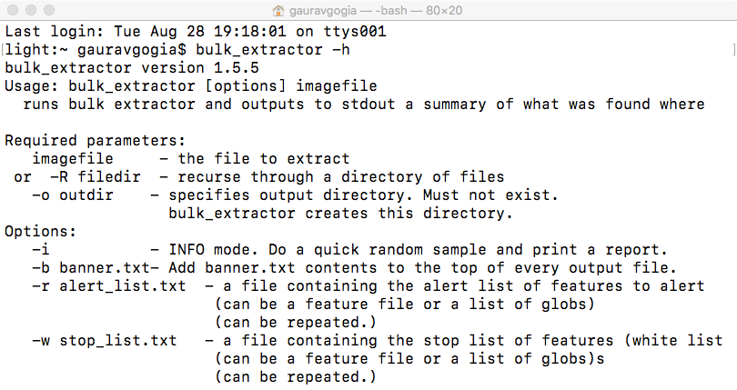
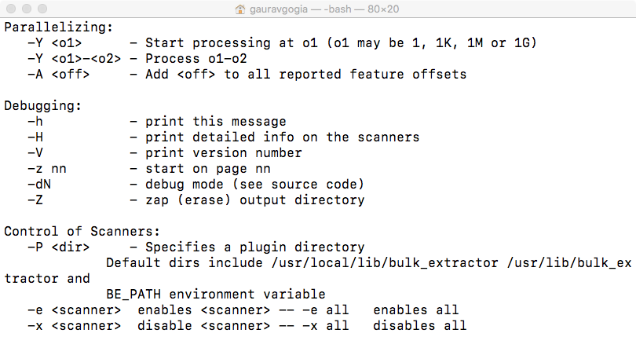
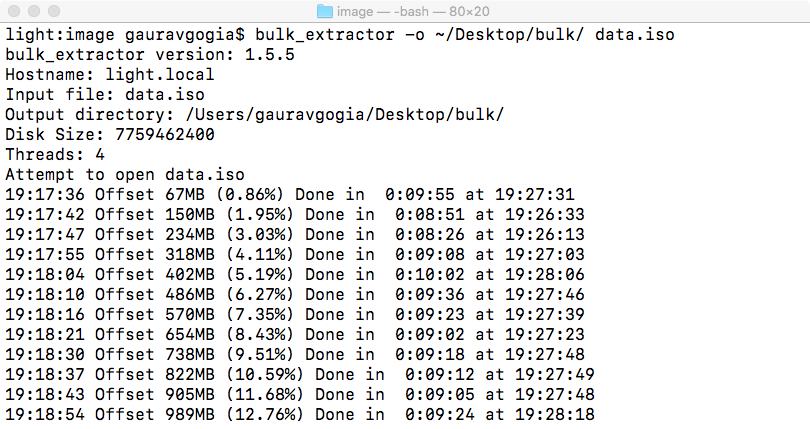
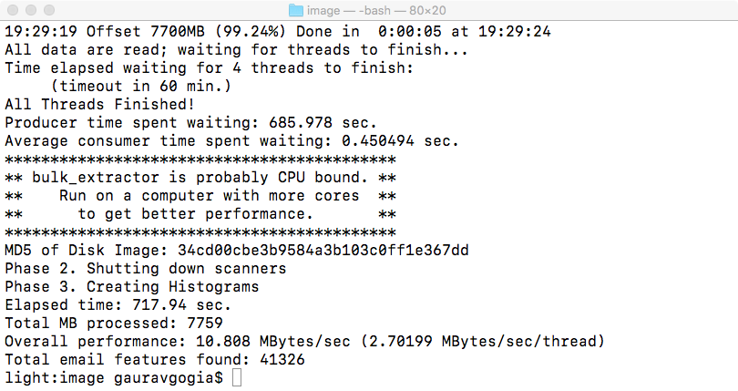
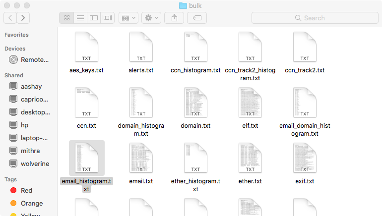

# Bulk Extractor
A data recovery and suspicious text extraction tool. Uses disk image as input.
Fore most information please visit [this site](https://forensicswiki.org/wiki/Bulk_extractor).

Bulk Extractor is a *nix based tool.

## Usage
1. `bulk_extractor -o <output dir> <disk image path>`

## Sample Output

