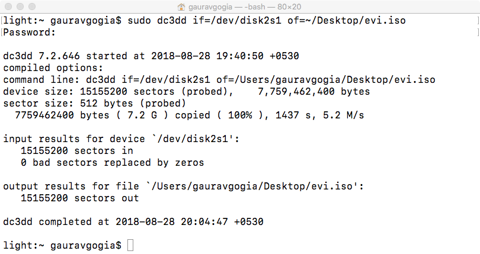

# DC3DD
An advanced version of DD created by DoD. Used for creating forensic copy of disks.
Works by making a bit-by-bit copy of the device, makes sure that nothing is left behind.
Supports file splitting(ideally 000 format/extension) and hash calculation.
For more info please visit [this link](https://forensicswiki.org/wiki/Dc3dd).

Works only with *nix systems.

## Usage:
1. `dc3dd if=<input device path> of=<output file path with extension>`
Output file path can be img/iso/dd or any other disk image extension.
Prefer using any one among above listed ones to avoid any problems.

2. `dc3dd -h` for more options

## Sample Output
