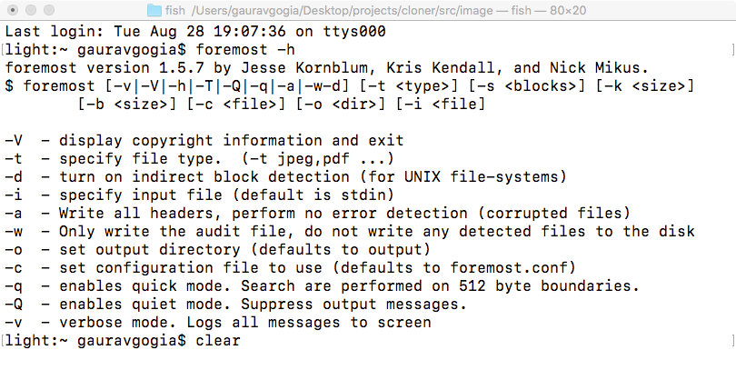
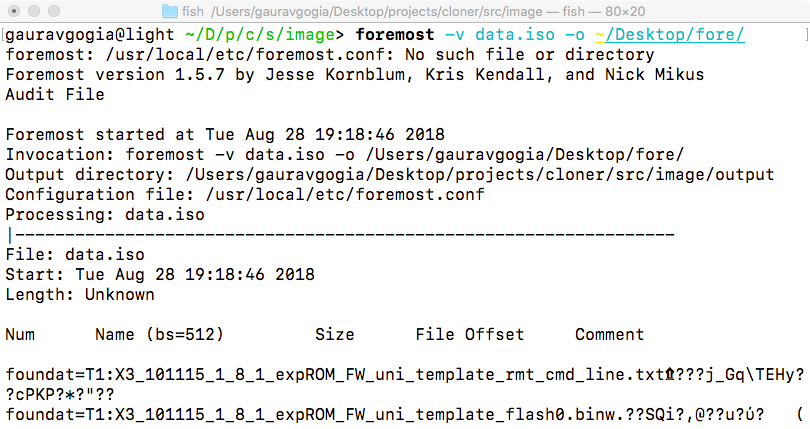
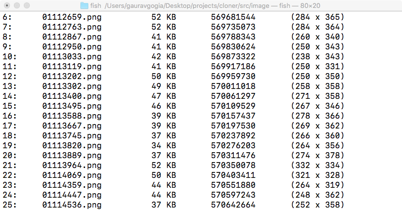
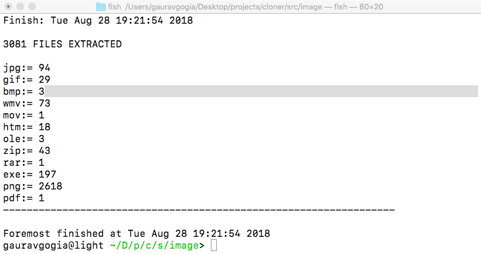
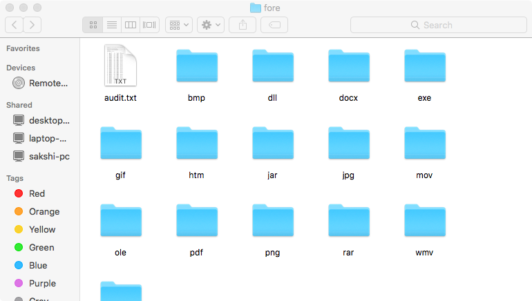

# Foremost
A forensic data recovery/carving tool that recovers deleted files from a disk image. 
For more information please visit [this site](https://forensicswiki.org/wiki/Foremost).

Foremost is *nix based.

## Usage
1. `foremost -v -o <output dir> -i <disk image path>` 
Above command will fire a verbose mode of foremost.

## Sample Output

