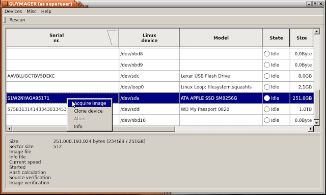

# Guymager
A GUI forensic imaging/cloning tool that can either help by creating a forensic image of a drive or clone the drive instead.
Just like DD/DC3DD this tool works by creating a bit-by-bit copy of the target. 
The tool supports file splitting(ideally E01 format/extension), reporting and hash calculation.

Works only with *nix systems.

For more info please visit [this link](https://guymager.sourceforge.io/)

## Usage & Sample Output

